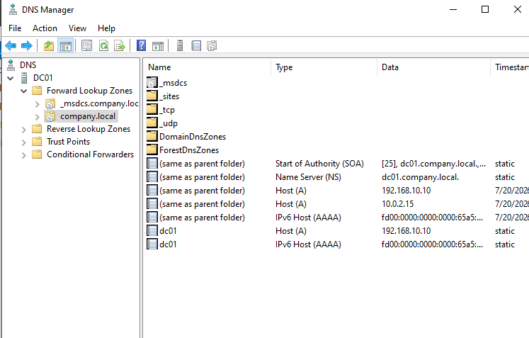

04 dns config readme · MD
# Phase 04 — DNS Configuration
 
**Status:** 🟢 Done (Parts A–C) / 🟡 Deferred (Part D — see notes)
**Host(s) involved:** DC01
**Date:** July 2026
 
## Objective
 
Clean up and properly configure the DNS zones that AD DS auto-created during
Phase 03's promotion — removing stale multi-adapter DNS registrations,
adding a reverse lookup zone, and (where possible) configuring internet
name resolution via a forwarder.
 
## Prerequisites
 
- Phase 03 complete: DC01 promoted, `company.local` forward zone and
  `_msdcs.company.local` auto-created
## Steps
 
### Part A — Reviewed existing DNS zones
Opened DNS Manager (Server Manager → Tools → DNS) and inspected the
auto-created zones: `company.local` (main forward zone) and
`_msdcs.company.local` (SRV records used by domain-joined machines to
locate domain controllers, Kerberos, and the Global Catalog). Confirmed
`company.local` held SOA/NS records plus multiple stale `DC01` host
records — one per network adapter on the machine, not just the intended
LabNet one.
 
### Part B — Cleaned up duplicate DNS host records
1. Disabled DNS registration on the **NAT** adapter for both IPv4 and IPv6
   (Adapter Properties → TCP/IPv4 and TCP/IPv6 → Advanced → DNS tab →
   unchecked "Register this connection's addresses in DNS").
2. Located and deleted the stale `DC01` A record (`10.0.2.15`) and three
   AAAA (IPv6) records directly in DNS Manager's zone record list —
   the console visually groups records under one hostname, but each
   entry is a separate deletable row.
   
3. Verified with `ipconfig /registerdns` and `Clear-DnsClientCache`,
   then confirmed clean resolution.
### Part C — Created the reverse lookup zone
Created an IPv4 Reverse Lookup Zone for `192.168.10.0/24` via DNS
Manager's New Zone Wizard: Primary zone, AD-integrated, replication scope

"all DNS servers running on domain controllers in this domain," 

secure
dynamic updates only. Confirmed reverse resolution (IP → hostname) works.

 
### Part D — DNS Forwarder (deferred, not completed — see below)

 
## Verification
 
```powershell
Resolve-DnsName DC01.company.local
```
Returns exactly one record: `A`, `192.168.10.10`.

 
```powershell
nslookup company.local
```
Returns only `192.168.10.10`.
 
```powershell
Get-DnsClient | Select-Object InterfaceAlias, RegisterThisConnectionsAddress
```
Confirms `NAT: False`, `LabNet: True` — the fix is durable at the adapter
configuration level, not just a momentary clean state.
 
```powershell
Resolve-DnsName 192.168.10.10
```
Returns PTR record → `DC01.company.local`, confirming the reverse zone
works correctly.
 
## Troubleshooting Notes
 
- **DNS Manager's record list visually groups multiple records under one
  hostname**, showing the name only on the first row and leaving
  subsequent rows blank in the Name column — easy to mistake for "just
  one entry" when it's actually several distinct records. Scrolling
  through by **Type** column (Host A / Host AAAA) rather than by Name
  made the individual records identifiable.
- **DNS Forwarder configuration could not be completed and verified in
  this environment.** Full diagnostic trail:
  - `Test-NetConnection <public DNS IP> -Port 53` failed; direct
    `ping` to both the NAT gateway (`10.0.2.2`) and public IPs
    (`8.8.8.8`) returned `Destination host unreachable` from DC01 itself.
  - Ruled out, in order: Windows routing table (confirmed correct
    default route `0.0.0.0/0 → 10.0.2.2` via NAT, lowest metric),
    Windows Firewall (all profiles enabled but not the cause — this is
    outbound traffic), adapter link state (`Get-NetAdapter` showed
    `Up`/`Connected`), and VirtualBox's NAT attachment setting
    (confirmed correctly set to "NAT," not "NAT Network").
  - `arp -a` showed **no ARP entry ever created** for the NAT gateway,
    even after an adapter restart — indicating the failure happens at
    the host/hypervisor network layer, before Windows-level
    troubleshooting can resolve it.
  - Root cause identified: **the host machine's internet connection
    itself is provided via a mobile hotspot (phone NetShare) routed
    through a VPN client on the host.** Disconnecting the VPN to test in
    isolation also removed the host's internet access entirely (the VPN
    appears required for the NetShare connection to function), so the
    VPN's specific interference with VirtualBox's NAT engine could not
    be cleanly isolated from "no internet at all."
  - **Decision:** deferred rather than continuing to troubleshoot, since
    AD DS/DNS/domain functionality does not require internet access on
    DC01, and this is a non-blocking, environment-specific constraint
    (unusual host networking stack) rather than a lab misconfiguration.
    To revisit if/when DC01's host is on a direct Wi-Fi/Ethernet
    connection without a VPN in the path.

## Next Phase
 
[05 - DHCP Configuration](../05-dhcp-config/README.md)
 
