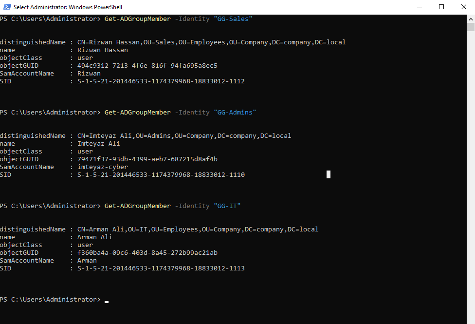

# Phase 07 — Users & Groups

**Status:** 🟢 Done
**Host(s) involved:** DC01
**Date:** 25-July 2026

## Objective

Populate the OU structure from Phase 06 with security groups and user
accounts, and assign users to their correct groups — establishing the
permissions model (grant access to groups, not individual users) that
Phase 10 (file server / NTFS permissions) will build on.


## Prerequisites

- Phase 06 complete: `Company` OU structure created

## Steps

### Part A — Created security groups
Created three Global Security groups inside `OU=Groups,OU=Company`:
- `GG-Sales`
- `GG-IT`
- `GG-Admins`


("GG-" prefix used as a naming convention to identify Global-scope groups
at a glance.) Group scope: **Global** (appropriate for organizing users
within a single domain). Group type: **Security** (not Distribution —
required, since only Security groups can be granted resource permissions,
needed in Phase 10).

### Part B — Created user accounts and assigned group membership
Created one user per department/role, placed directly in the matching OU:

| User | OU | Group |
|---|---|---|
| Rizwan Hassan (`Rizwan`) | Employees\Sales | GG-Sales |
| Arman Ali (`Arman`) | Employees\IT | GG-IT |
| Imteyaz Ali (`imteyaz-cyber`) | Admins | GG-Admins |


Password policy: complexity enforced (Windows default), "password never
expires" left **unchecked** intentionally, so expiration policy can be
observed working correctly once Group Policy is configured in Phase 09.

Assigned each user to their group via ADUC → user Properties → Member Of
 

## Verification

```powershell
Get-ADUser -Filter * -SearchBase "OU=Company,DC=company,DC=local" | Select-Object Name, DistinguishedName
```

Confirmed all three users exist in their correct OUs.

```powershell
Get-ADGroup -Filter * -SearchBase "OU=Groups,OU=Company,DC=company,DC=local" | Select-Object Name, GroupCategory, GroupScope
```

Confirmed all three groups: `GroupCategory: Security`, `GroupScope: Global`.

```powershell
Get-ADGroupMember -Identity "GG-Sales"
Get-ADGroupMember -Identity "GG-IT"
Get-ADGroupMember -Identity "GG-Admins"
```

Confirmed each group contains exactly its intended member — actual group
membership verified directly, not just assumed from group/user existing
independently.

## Troubleshooting Notes

No issues encountered — groups, users, and group membership assignment
all completed correctly on the first pass, verified with explicit
membership checks rather than assuming the "Add to group" step succeeded.

## Screenshots / Evidence

Place in `docs/07-users-groups/`:

1. **`07-01-new-group-dialog.png`** — the New Object - Group dialog
   showing Group scope: Global, Group type: Security selected.
   → Place under **Part A**.
2. **`07-02-new-user-wizard.png`** — the New Object - User wizard,
   showing password options (password never expires unchecked).
   → Place under **Part B**.
3. **`07-03-member-of-tab.png`** — a user's Properties → Member Of tab
   showing the assigned group.
   → Place under **Part B**, right after describing the assignment step.


## Next Phase

[08 - Client Domain Join](../08-client-join/README.md)