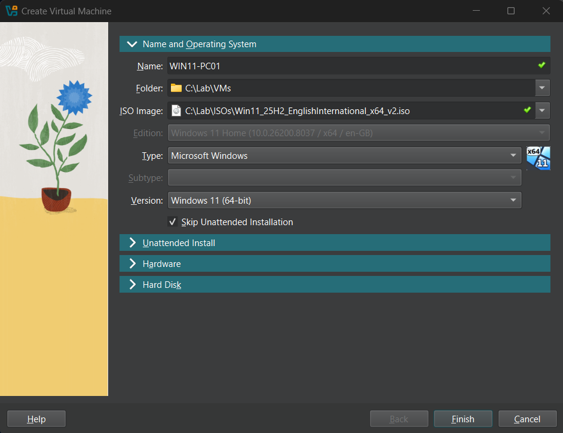

# Phase 08 — Client Domain Join (WIN11-PC01)

**Status:** 🟢 Done
**Host(s) involved:** DC01, WIN11-PC01
**Date:** 25-July 2026

## Objective

Create a Windows 11 client VM, connect it to the isolated LabNet segment,
confirm it receives networking automatically via DC01's DHCP scope
(Phase 05), and join it to `company.local` — the first true end-to-end
test of DHCP, DNS, and AD DS working together for a real client.

## Prerequisites

- Phases 02–07 complete: DC01 promoted, DNS cleaned up, DHCP scope active,
  OU structure and at least one test user (`Rizwan`, Sales) created
- `Win11_25H2_EnglishInternational_x64_v2.iso` at `C:\Lab\ISOs\`

## Steps

### Part A — Created the WIN11-PC01 VM
VirtualBox VM: 3072 MB RAM, 2 vCPU, 60 GB dynamically-allocated VDI,
storage folder `C:\Lab\VMs`, "Skip Unattended Installation" checked (same
reasoning as DC01 — interactive Setup, not an automated install).


### Part B — Network adapter configuration
Single adapter (unlike DC01's two): Internal Network, name `LabNet` —
WIN11-PC01 doesn't need a separate NAT/internet path for this lab.


### Part C — Windows 11 installation
Ran interactive Setup. Chose "Set up for personal use" → local account
(temporary, replaced by domain login after join) → skipped
privacy/Cortana/OneDrive prompts with defaults.


### Part D — Installed Guest Additions
Same process as DC01 — mounted the Guest Additions CD, ran the installer,
enabled bidirectional shared clipboard.

### Part E — Verified DHCP/DNS before attempting domain join
Confirmed via `ipconfig /all` that WIN11-PC01 received full networking
automatically from DC01, with no manual configuration required.

### Part F — Joined the domain
System Properties → Change → Domain: `company.local`, authenticated as
`COMPANY\Administrator`, rebooted, logged in afterward as a real domain


user (`COMPANY\Rizwan` — the Sales user created in Phase 07).


### Part G — Moved the computer object into the correct OU
By default, AD places newly domain-joined computers in the built-in
`CN=Computers` container, not any custom OU — moved `WIN11-PC01` into
`Company\Computers\WorkStations` via ADUC, since Phase 09's Group Policy
will need to target this OU specifically.

## Verification

```powershell
ipconfig /all
```
Confirmed on WIN11-PC01:
- `IPv4 Address: 192.168.10.101` — within the DHCP scope range
  (`192.168.10.100`–`.200`) created in Phase 05
- `DHCP Server: 192.168.10.10` — confirms DC01 specifically issued the
  lease
- `DNS Servers: 192.168.10.10` — matches Option 6 from the scope
- `Default Gateway:` blank — correctly absent, matching the intentional
  no-router design of the isolated LabNet segment
- `DNS Suffix Search List: company.local` — matches Option 15

```powershell
Get-ComputerInfo | Select-Object CsDomain, CsDomainRole
```
`CsDomain: company.local`, `CsDomainRole: MemberWorkstation` — confirms
successful domain join.

```powershell
Get-ADComputer -Filter *
```
(run on DC01) Confirmed `WIN11-PC01` registered in AD.

```powershell
Get-ADComputer -Identity "WIN11-PC01" | Select-Object Name, DistinguishedName
```
After the OU move: `DistinguishedName:
CN=WIN11-PC01,OU=WorkStations,OU=Computers,OU=Company,DC=company,DC=local`
— confirms the computer object now sits in the intended OU.

## Troubleshooting Notes

- **Windows 11 Setup showed a "Load driver" prompt on the network screen**
  instead of the expected offline-setup option. Root cause: the VM's
  network adapter had been created with **no Adapter Type selected** in
  VirtualBox (left blank), so Windows Setup genuinely had no virtual NIC
  to detect — not, as first suspected, Microsoft's forced
  account-sign-in gate. Attempting the `oobe\bypassnro` command at this
  stage had no effect, since that command only skips the
  Microsoft-account requirement and does nothing when no network adapter
  exists at all.
  - **Fix:** powered off the VM, went into Settings → Network → Adapter
    1 → Advanced, and explicitly selected **Intel PRO/1000 MT Desktop
    (82540EM)** as the Adapter Type (previously blank). Restarted Setup
    from scratch — the network screen then correctly detected LabNet and
    offered a genuine **"I don't have internet" → "Continue with limited
    setup"** path.
  - **Lesson:** a "Load driver" prompt during Windows Setup's network
    step is a sign of a missing/undetected adapter, not necessarily an
    account-signup gate — worth diagnosing which one it actually is
    before reaching for the `bypassnro` bypass, since it only solves one
    of the two possible causes.
- **DHCP lease timestamp showed an obviously wrong date (1890)** in
  `ipconfig /all` output on first boot. Investigated by checking the
  actual system clock with `Get-Date` rather than assuming the whole
  system time was broken — confirmed the real clock was correct; the odd
  lease-timestamp value was an isolated display quirk in freshly-created
  VMs, not a genuine system clock problem. Verified before attempting
  domain join specifically because Kerberos authentication (which AD
  relies on) requires client/server clocks to be within a small
  tolerance, and a genuinely wrong clock would have caused a confusing
  domain-join failure.
- Guest Additions and clipboard setup required again on this VM
  separately from DC01 — each VM needs this configured independently, it
  does not carry over between VMs.

## Screenshots / Evidence

Place in `docs/08-client-join/`:

1. **`08-01-adapter-type-blank-vs-fixed.png`** — before/after of the
   VirtualBox Adapter Type setting (blank, then Intel PRO/1000 MT
   Desktop selected).
   → Place under **Part B**, alongside the troubleshooting note — this
   is the most instructive screenshot in the phase.
2. **`08-02-oobe-no-internet-option.png`** — the "I don't have internet"
   / "Continue with limited setup" screen once the adapter fix worked.
   → Place under **Part C**.
3. **`08-03-ipconfig-dhcp-lease.png`** — the `ipconfig /all` output
   showing the DHCP-leased IP, DHCP server, and DNS server.
   → Place under **Part E** / Verification — this is the key "proof
   DHCP worked end-to-end" screenshot.
4. **`08-04-domain-join-success-dialog.png`** — the "Welcome to the
   company.local domain" confirmation dialog.
   → Place under **Part F**.
5. **`08-05-adcomputer-ou-verification.png`** — the final
   `Get-ADComputer` output showing the corrected OU placement (already
   captured as text above; screenshot optional).

## Next Phase

[09 - Group Policy](../09-group-policy/README.md)