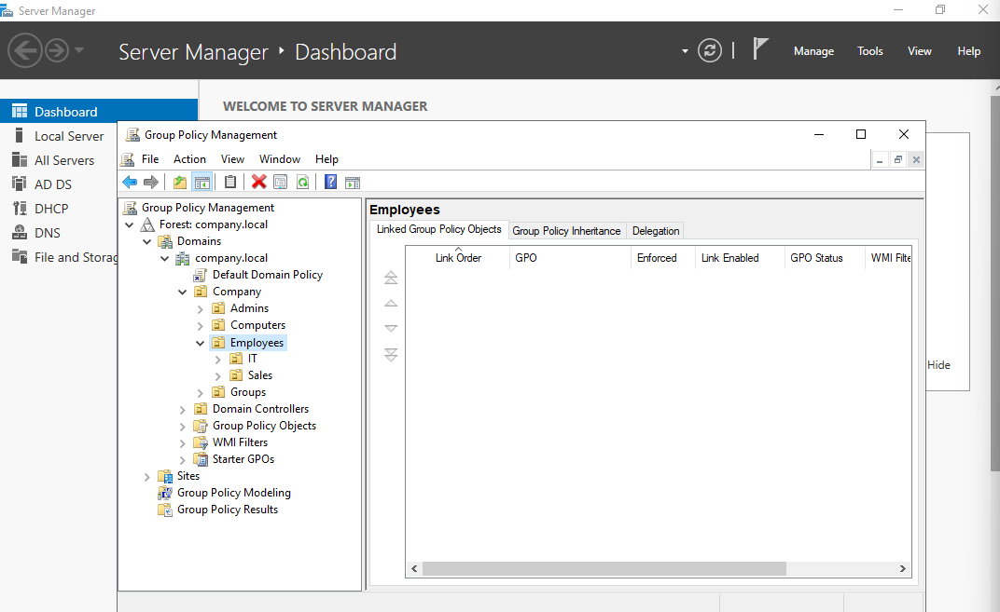

# Phase 09 — Group Policy

**Status:** 🟢 Done
**Host(s) involved:** DC01, WIN11-PC01
**Date:** July 2026

## Objective

Create Group Policy Objects (GPOs) linked to specific OUs and prove that
policy scoping works correctly — a user in `Sales` receives only Sales'
policy, a user in `IT` receives only IT's policy, and a user in `Admins`
(sitting outside both, by design from Phase 06) receives neither. This is
the first phase where the OU structure built in Phase 06 actually does
enforcement work, rather than just organizing objects.

## Prerequisites

- Phase 06 complete: `Sales`, `IT`, `Admins` OUs exist under `Company\Employees`/`Company`
- Phase 07 complete: `Rizwan` (Sales), `Arman` (IT), `Imteyaz Ali`/`imteyaz-cyber` (Admins) user accounts exist
- Phase 08 complete: WIN11-PC01 domain-joined and placed in `Company\Computers\WorkStations`

## Steps

### Part A — Reviewed the OU tree in Group Policy Management Console (GPMC)
Confirmed GPMC (Server Manager → Tools → Group Policy Management) browses
the same OU structure as ADUC, under
`Forest: company.local → Domains → company.local → Company → Employees`.


### Part B — Created and linked `Sales-Restrict-ControlPanel`
Linked directly to the **Sales** OU. Setting used:
`User Configuration → Policies → Administrative Templates → Control Panel 


→ Prohibit access to Control Panel and PC settings` → **Enabled**.


### Part C — Created and linked `IT-Restrict-CommandPrompt`
Linked directly to the **IT** OU. Setting used:
`User Configuration → Policies → Administrative Templates → System →
Prevent access to the command prompt` → **Enabled** (script processing
left allowed — only interactive cmd blocked).


### Part D — Tested as Rizwan (Sales)
Forced policy refresh (`gpupdate /force`), logged off/on to ensure full
application, confirmed Control Panel/Settings access was blocked with a
restriction message.


### Part E — Tested as Arman (IT)
Same refresh/logoff process. Confirmed Command Prompt access was blocked.


**Also confirmed Control Panel opened normally for Arman** — the
negative-test proof that Sales' policy did not leak into IT.

### Part F — Baseline check as Imteyaz (Admins)
Confirmed both Control Panel and Command Prompt worked completely
normally, with no restriction of any kind — proving the Admins OU (a
sibling of Employees, not nested inside it, per the Phase 06 design)
correctly sits outside the scope of both GPOs.


## Verification

```powershell
gpupdate /force
```
Run after each user login to force immediate policy refresh rather than
waiting for the default ~90 minute client refresh interval.

```powershell
gpresult /r
```
Run per-user to confirm exactly which GPOs applied:
- **Rizwan (Sales):** `Sales-Restrict-ControlPanel` listed under Applied
  Group Policy Objects (User); `IT-Restrict-CommandPrompt` absent.
- **Arman (IT):** `IT-Restrict-CommandPrompt` listed; `Sales-Restrict-ControlPanel`
  absent.
- **Imteyaz (Admins):** neither GPO listed under Applied Group Policy
  Objects — confirms no leakage outside the linked OUs.

— gpresult output for at least one tested user,
showing the Applied Group Policy Objects section]

## Troubleshooting Notes

- Initial confusion locating the "Prohibit access to Control Panel and PC
  settings" setting — clicking the **Control Panel** folder in the GPO
  editor's left tree shows subfolders (Personalization, Regional and
  Language Options, User Accounts) mixed alphabetically together with
  individual settings in the same right-hand pane, rather than in
  separate views. Resolved by scrolling the right-hand list directly
  rather than looking inside the subfolders.
- No other issues — both GPOs applied correctly on first test after a
  logoff/logon cycle; `gpupdate /force` alone (without logging off) was
  not relied upon as suffient for these particular User Configuration
  settings, per the known behavior that some User Configuration policies
  need a fresh logon to take full effect.

## Screenshots / Evidence

Place in `docs/09-group-policy/`:

1. [SCREENSHOT PLACEHOLDER] `09-01-gpmc-ou-tree.png` — GPMC tree showing
   Sales/IT OUs under Company\Employees.
   → Place under **Part A**.
2. [SCREENSHOT PLACEHOLDER] `09-02-sales-gpo-setting-enabled.png` —
   "Prohibit access to Control Panel" setting dialog, Enabled selected.
   → Place under **Part B**.
3. [SCREENSHOT PLACEHOLDER] `09-03-it-gpo-setting-enabled.png` —
   "Prevent access to the command prompt" setting dialog, Enabled.
   → Place under **Part C**.
4. [SCREENSHOT PLACEHOLDER] `09-04-rizwan-control-panel-blocked.png` —
   restriction message when Rizwan opens Control Panel/Settings.
   → Place under **Part D**.
5. [SCREENSHOT PLACEHOLDER] `09-05-rizwan-gpresult.png` — `gpresult /r`
   for Rizwan showing `Sales-Restrict-ControlPanel` applied.
   → Place under **Part D**, Verification.
6. [SCREENSHOT PLACEHOLDER] `09-06-arman-cmd-blocked.png` — restriction
   message when Arman opens Command Prompt.
   → Place under **Part E**.
7. [SCREENSHOT PLACEHOLDER] `09-07-arman-control-panel-works.png` —
   Control Panel opening normally for Arman (negative-test proof).
   → Place under **Part E** — as important as #6, since it proves
   isolation between OUs, not just that IT's own policy works.

8.    for Arman showing only `IT-Restrict-CommandPrompt` applied.
   
   

9.   
    for Imteyaz showing no GPOs applied.
    → Place under **Part F**, Verification — the single most important
    screenshot in this phase, since it's the definitive proof that the
    Phase 06 OU-separation design (Admins as a sibling, not nested
    inside Employees) actually enforces isolation as intended.

## Next Phase

[10 - File Server / NTFS Permissions](../10-file-server-ntfs/README.md)