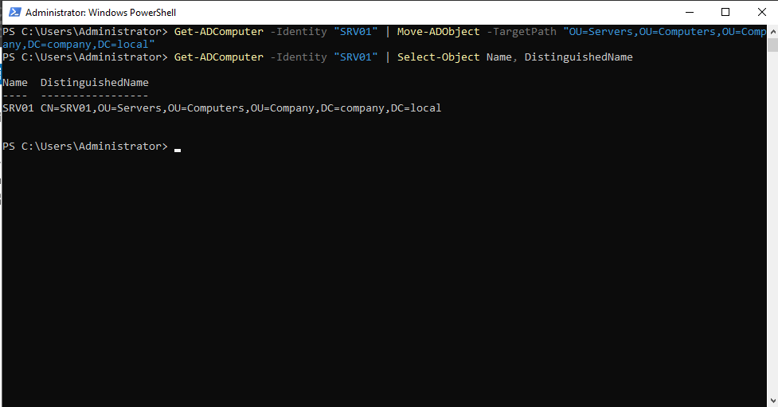
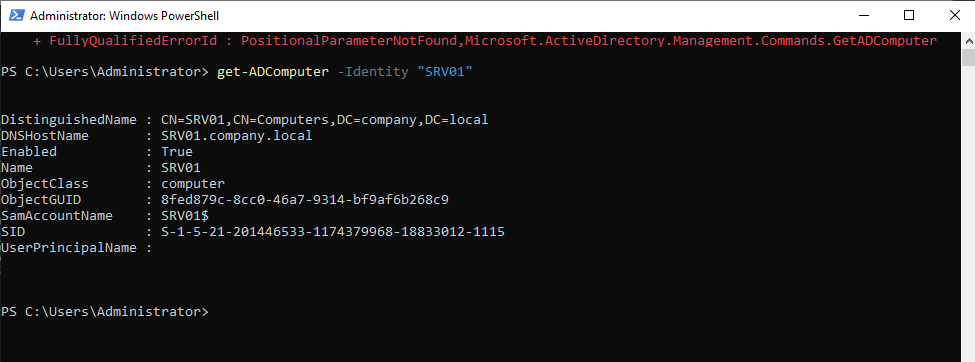

# Phase 10 — File Server / NTFS Permissions (SRV01)

**Status:** 🟡 In Progress (Parts 1–4 of 5 complete — shares and NTFS
permissions configured and verified; live access testing as domain users
pending)
**Host(s) involved:** DC01, SRV01
**Date:** July–August 2026

## Objective

Build SRV01 as a Windows Server 2022 Server Core file server, join it to
`company.local`, and configure department file shares with NTFS
permissions scoped to the `GG-Sales` and `GG-IT` security groups created
in Phase 07 — demonstrating the layered Share + NTFS permission model and
least-privilege access control.

## Prerequisites

- Phase 07 complete: `GG-Sales`, `GG-IT` security groups exist
- Phase 06 complete: `Company\Computers\Servers` OU exists

## Steps

### Part 1 — VM creation and initial networking (previous session)
Created the SRV01 VM (2048 MB RAM, 2 vCPU, 60 GB dynamically-allocated
VDI), installed Windows Server 2022 Standard Evaluation as **Server
Core** (chosen deliberately over Desktop Experience for lighter RAM
usage and additional PowerShell practice), renamed to `SRV01` via
`sconfig`, and configured static networking (`192.168.10.20`, no
gateway, DNS `192.168.10.10`) via PowerShell after `sconfig`'s network
wizard proved unable to handle a blank gateway field correctly.

### Part 2 — Guest Additions limitation discovered, pivoted to remote management
Attempted to install Guest Additions and enable clipboard sharing
directly on SRV01's console, following the same process used
successfully on DC01 and WIN11-PC01. This did not work, and investigation
revealed why: clipboard sharing depends on **VBoxTray**, a system-tray
component that requires a desktop shell (Explorer) to run — which Server
Core does not have by design. This is not a fixable configuration issue;
it's an inherent limitation of the Server Core installation option.

**Resolution — pivoted to the realistic, production-appropriate approach:**
manage SRV01 remotely via PowerShell from DC01, rather than working at
SRV01's own console. This is genuinely how Server Core machines are
operated day-to-day in real environments.
```powershell
# On SRV01 (one-time, at the console):
Enable-PSRemoting -Force
screenshots/1 enable PSRemote.png

# On DC01:
Set-Item WSMan:\localhost\Client\TrustedHosts -Value "192.168.10.20" -Force
Enter-PSSession -ComputerName 192.168.10.20 -Credential SRV01\Administrator
```

### Part 3 — Domain join (via remote session)
```powershell
Add-Computer -DomainName "company.local" -Credential COMPANY\Administrator -Restart
```

First attempt failed with `The user name or password is incorrect` —
traced to a credential-entry issue at the interactive prompt, not an
actual wrong password. Resolved by using `Get-Credential` to capture
credentials explicitly (and pasting the password rather than typing it,
to eliminate transcription error) before passing them to `Add-Computer`.

After the join and reboot, moved the computer object into its OU (run
from DC01, since SRV01/Server Core does not have AD management tools
installed):
```powershell
Get-ADComputer -Identity "SRV01" | Move-ADObject -TargetPath "OU=Servers,OU=Computers,OU=Company,DC=company,DC=local"
```


### Part 4 — Created shares and NTFS permissions (via remote session)
```powershell
New-Item -Path "C:\Shares\Sales" -ItemType Directory
New-Item -Path "C:\Shares\IT" -ItemType Directory


New-SmbShare -Name "Sales" -Path "C:\Shares\Sales" -FullAccess "COMPANY\GG-Sales"
New-SmbShare -Name "IT" -Path "C:\Shares\IT" -FullAccess "COMPANY\GG-IT"

icacls "C:\Shares\Sales" /grant "COMPANY\GG-Sales:(OI)(CI)M" /inheritance:r
icacls "C:\Shares\IT" /grant "COMPANY\GG-IT:(OI)(CI)M" /inheritance:r
```

Design reasoning: Share-level permissions were deliberately kept
generous (Full Access to the relevant group) — the real, fine-grained
restriction happens at the **NTFS** layer via `icacls`, avoiding the
need to maintain two separate, potentially conflicting permission
systems for the same folder. `/inheritance:r` strips the folder's
default inherited permissions, which would otherwise silently allow
broader built-in groups access despite the explicit grant; `(OI)(CI)M`
grants Modify (not Full Control) so the group can read/write/delete
files but not alter permissions or take ownership.

## Verification

```powershell
hostname
```
(via remote session) Confirmed `SRV01`.

```powershell
Get-ADComputer -Identity "SRV01" | Select-Object Name, DistinguishedName
```

(on DC01) Confirmed `CN=SRV01,OU=Servers,OU=Computers,OU=Company,DC=company,DC=local`.

```powershell
icacls "C:\Shares\Sales"
icacls "C:\Shares\IT"
```
Confirmed each folder shows only its intended group —
`COMPANY\GG-Sales:(OI)(CI)(M)` on Sales, `COMPANY\GG-IT:(OI)(CI)(M)` on
IT — with no leftover broad inherited permissions.

```powershell
Get-SmbShare
```
[SCREENSHOT/OUTPUT PLACEHOLDER — confirm both Sales and IT shares listed
with correct paths]

## Remaining for this phase

- [ ] Test live access as `Rizwan` (Sales) from WIN11-PC01: confirm
      `\\SRV01\Sales` accessible and writable, `\\SRV01\IT` denied
- [ ] Test live access as `Arman` (IT) from WIN11-PC01: confirm
      `\\SRV01\IT` accessible and writable, `\\SRV01\Sales` denied

## Troubleshooting Notes

- **Clipboard sharing does not work on Server Core**, regardless of how
  many times Guest Additions is installed — root cause is architectural
  (VBoxTray requires a desktop shell that Server Core doesn't have), not
  a misconfiguration. Recognized this after the second failed attempt
  rather than continuing to retry the same fix, and pivoted to remote
  PowerShell management instead — which is both a practical workaround
  and a more realistic representation of how Server Core is actually
  administered in production environments.
- `Add-Computer` domain join failed on the first attempt with a
  misleading-sounding credential error; root cause was an issue at the
  interactive credential prompt rather than the password itself being
  wrong. Resolved using `Get-Credential` with a pasted (not typed)
  password to remove transcription risk. Worth remembering for future
  troubleshooting: an "incorrect username or password" error from
  `Add-Computer` isn't always proof the stored password is wrong — the
  prompt itself can be the source of the error.

## Screenshots / Evidence

Place in `docs/10-file-server-ntfs/`:

1. **`10-01-srv01-vm-settings.png`** — VirtualBox VM settings (from
   Part 1).
2. **`10-02-ipconfig-static-verification.png`** — static IP verification
   (from Part 1).
3. **`10-03-remote-pssession-connect.png`** — the `Enter-PSSession`
   connection into SRV01 from DC01, showing the `[192.168.10.20]:`
   prompt.
   → Place under **Part 2** — good evidence of the remote-management
   pivot.
4. **`10-04-domain-join-success.png`** — successful `Add-Computer`
   output after the credential fix.
   → Place under **Part 3**.
5. **`10-05-icacls-verification.png`** — the `icacls` output for both
   Sales and IT folders (already captured as text above; screenshot
   optional).
   → Place under **Part 4** / Verification.
6. [Part 5 screenshots — Rizwan/Arman access tests — to be added once
   that testing session is documented.]

## Next Phase

Complete Part 5 (live access testing) before moving to
[11 - DFS](../11-dfs/README.md).